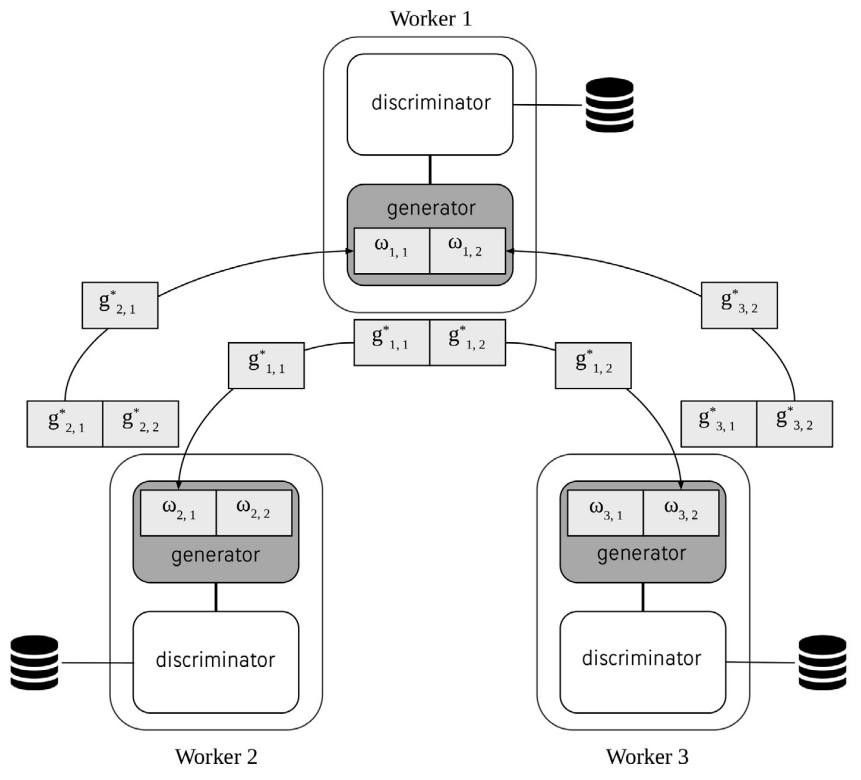

# DEGAN: Decentralized Generative Adversarial Networks
[](https://doi.org/10.1016/j.neucom.2020.07.089)


This is a DEGAN implementation based on [Ako](https://lsds.doc.ic.ac.uk/sites/default/files/ako-socc16.pdf) (Ako: Decentralised Deep Learning with Partial Gradient Exchange). You can train any DNNs in a decentralized manner without parameter servers. Workers exchange partitioned gradients directly with each other without help of parameter servers and update their own local weights.

### Installation
    
 - Prerequisites 
    - redis-server & redis-client 
    - tflearn (only for loading CIFAR10 dataset)
        ```sh
        $ python -m venv ./venvs/degan
        $ source ./venvs/degan/bin/activate
        $ sudo apt-get update
        $ sudo apt-get install redis-server -y
        ```

### Overview
Decentralized generative adversarial networks architecture with partial gradient exchange.
<p align="center">
    
</p>

### Quick Start

```sh 
$ pkill -f "redis-server"
$ python parallel.py
```

1. Build your model in **redis_ako_model.py**
2. Write your session and load your dataset in **redis_ako.py**
3. Change your configurations in **redis_ako_config.py**
    - Basic configurations: Cluster IP/Port, Redis port, Synchronous training, Training epochs, Batch size, Number of batches
    - Ways to train models: training a few iterations, training for a fixed time, training until a fixed accuracy 
    - Ako specific configurations: P values, partition details, SSP interation bound, Number of queue threads
4. Execute it 
    ```sh
    # When 3 workers are clustered and used for decentralized DL
    # At worker 0
    $ python redis_ako.py wk 0 
    # At worker 1
    $ python redis_ako.py wk 1
    # At worker 2
    $ python redis_ako.py wk 2
    ```

